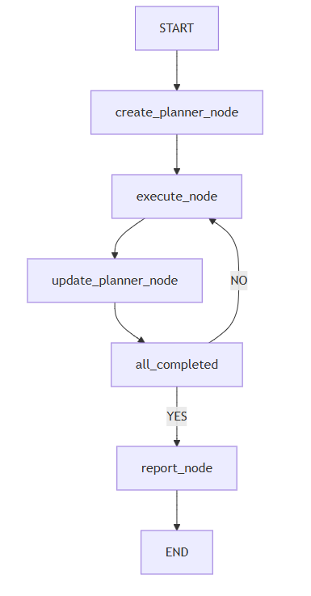

# LiteManus
<p align="center"><b>A lightweight Manus-inspired agent framework</b></p>
<p align="center">
  <a href="README.md">English</a> | <a href="README_zh.md">简体中文</a>
</p>

## 📌 Introduction

**LiteManus** is a lightweight agent framework built with **LangGraph** and **LangChain**.  
It can turn a user request into an executable action plan, carry out tasks step-by-step via tool-calling, iteratively update the plan based on real-time observations, and finally generate a complete **Markdown report (`workspace/report.md`)** with embedded analysis images produced during the run.

---

## ✨ Key Features

- A closed-loop workflow of **Plan → Execute → Observe → Re-plan** (driven by a LangGraph state machine)
- **Tool-calling execution**: run shell commands, read/write files, generate charts/images, etc.
- **Workspace-managed artifacts**: all intermediate files and visual outputs are written to `workspace/`
- **Final Markdown report**: outputs `workspace/report.md` and embeds images using standard Markdown syntax

---

## 🏗 Architecture & Workflow

This project implements a LangGraph state-machine workflow (as shown in the diagram below):

<p align="center">
  
</p>

### Node Responsibilities

#### `create_planner_node`

- Generates an initial plan in structured JSON format (Goal + Steps).
- Each step includes:
  - An executable description (what to do)
  - Expected outputs (what results/files should be produced)
  - A verification approach (how to determine the step is complete)

#### `execute_node`

- Executes the current pending step.
- Uses tools to:
  - Run shell commands
  - Create/modify files under `workspace/`
- Produces **observations**, for example:
  - Execution results and key metrics
  - Generated filenames/paths
  - Generated images (e.g., `.png` charts)

#### `update_planner_node`

- Iteratively updates the plan based on the latest observations.
- Possible adjustments include:
  - Refining remaining steps
  - Adding missing steps
  - Removing unnecessary steps
  - Reordering execution when needed

#### `all_completed`

- Checks whether all steps are completed:
  - **NO** → return to `execute_node` to continue execution
  - **YES** → proceed to `report_node` to generate the report

#### `report_node`

- Summarizes the final results into a **Markdown** report.
- Writes to `workspace/report.md`.
- Embeds images using standard Markdown syntax:
  - ``

---

## 📁 Project Structure (Common Example)

> Your actual repository structure may vary slightly, but it typically follows this layout:

```
LiteManus/
├─ workspace/               # runtime outputs (generated files, images, reports, etc.)
│  └─ report.md             # final Markdown report
├─ graph.py                 # example entry for the LangGraph workflow
├─ requirements.txt         # Python dependencies
└─ README.md
```

---

## 🚀 Installation

### 1) Create and activate a virtual environment (recommended)

**PowerShell (Windows):**

```powershell
python -m venv .venv
.\.venv\Scripts\Activate.ps1
```

**bash/zsh (macOS/Linux):**

```bash
python -m venv .venv
source .venv/bin/activate
```

### 2) Install dependencies

```bash
pip install -r requirements.txt
```

---

## 🛠 Running

### 1) Configure environment variables

LiteManus uses **ChatOpenAI** and reads configuration from environment variables.

#### Required

- `API_KEY`: your LLM provider key

#### Optional

- `BASE_URL`: defaults to `https://api.getgoapi.com/v1`
- `WORKSPACE_DIR`: defaults to `<project_root>/workspace`

##### PowerShell (Windows)

```powershell
$env:API_KEY="YOUR_KEY_HERE"
$env:BASE_URL="https://api.getgoapi.com/v1"   # optional
$env:WORKSPACE_DIR="$pwd\workspace"          # optional
```

##### bash / zsh (Linux/macOS)

```bash
export API_KEY="YOUR_KEY_HERE"
export BASE_URL="https://api.getgoapi.com/v1"   # optional
export WORKSPACE_DIR="$(pwd)/workspace"         # optional
```

> Tip: If you want these variables to persist across terminal sessions, add them to your shell profile
> (e.g., PowerShell Profile, `~/.zshrc`, `~/.bashrc`).

### 2) Run the agent

Run the workflow (the main entry is typically in `graph.py`):

```bash
python graph.py
```

---

## 📦 Outputs

All generated artifacts (intermediate files, charts, images, etc.) are written to:

- `workspace/`

Final report file:

- `workspace/report.md`

Open `workspace/report.md` to view both the textual results and embedded visualizations (e.g., `.png` charts saved during execution).

---

## 🖼 Example: Embedding Images in the Report

If an image is generated at `workspace/figures/plot.png`, the report can include:

```md

```

---

## 🧯 Troubleshooting

- **`API_KEY` not set / authentication failed**
  - Make sure `API_KEY` is correctly set in the current terminal session before running.
- **Workspace directory not found / write failed**
  - Ensure `workspace/` exists, or point `WORKSPACE_DIR` to a valid directory.
- **Dependency installation errors**
  - Try using a fresh virtual environment and re-run `pip install -r requirements.txt`.
